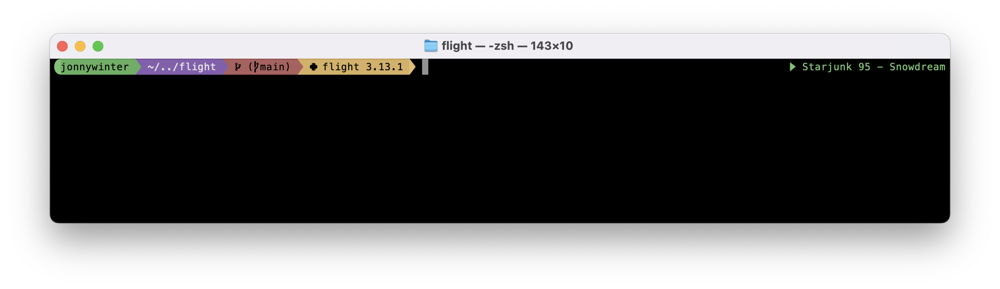

# Mutagen

A muted, 1990s arcade-inspired theme for [Oh My Posh](https://ohmyposh.dev/).

Mutagen combines a soft turtle-green base with purple, orange, blue and yellow accents. It keeps the recognisable energy of classic mutant-comic colour palettes without being excessively bright or distracting during everyday terminal use.



## Features

- Compact Powerline-style prompt
- Username and session information
- Current working directory
- Git branch, upstream and stash information
- Node.js version detection
- Python virtual environment and version detection
- Right-aligned Spotify track information
- Separate playing and paused Spotify icons
- Muted palette designed for dark terminal backgrounds

The Spotify segment is displayed only while a track is playing or paused. It remains hidden when Spotify is stopped.

## Palette

| Segment | Inspiration | Colour |
|---|---|---|
| Session | Turtle green | `#6FAE3D` |
| Path | Muted purple | `#7654B0` |
| Git | Muted orange | `#C16F55` |
| Node.js | Muted blue | `#7095AC` |
| Python | Muted yellow | `#D5C04F` |
| Spotify | Soft green | `#65BE72` |

## Requirements

- [Oh My Posh](https://ohmyposh.dev/)
- A terminal using a [Nerd Font](https://www.nerdfonts.com/)
- A shell supported by Oh My Posh
- Spotify, if you want to use the music segment

The theme uses Nerd Font glyphs for its Powerline separators and development-tool icons.

> [!NOTE]
> The right-aligned Spotify segment is supported in PowerShell, Zsh, Fish,
> Nushell and cmd. Bash requires [ble.sh](https://github.com/akinomyoga/ble.sh)
> for right-prompt support.

## Installation

Clone the repository:

```shell
git clone https://github.com/jonnywinter/oh-my-posh-mutagen.git
```

Alternatively, download `mutagen.omp.json` directly and save it somewhere in your home directory.

### PowerShell

Add the following to your PowerShell profile:

```powershell
oh-my-posh init pwsh `
  --config "$HOME\oh-my-posh-mutagen\mutagen.omp.json" |
  Invoke-Expression
```

To open your PowerShell profile:

```powershell
notepad $PROFILE
```

Reload the profile after saving:

```powershell
. $PROFILE
```

### Zsh

Add the following to `~/.zshrc`:

```shell
eval "$(oh-my-posh init zsh --config ~/oh-my-posh-mutagen/mutagen.omp.json)"
```

Reload your configuration:

```shell
source ~/.zshrc
```

### Bash

Add the following to `~/.bashrc`:

```shell
eval "$(oh-my-posh init bash --config ~/oh-my-posh-mutagen/mutagen.omp.json)"
```

Reload your configuration:

```shell
source ~/.bashrc
```

### Fish

Add the following to `~/.config/fish/config.fish`:

```fish
oh-my-posh init fish --config ~/oh-my-posh-mutagen/mutagen.omp.json | source
```

## Remote configuration

Oh My Posh can also load the theme directly from GitHub:

```powershell
oh-my-posh init pwsh `
  --config "https://raw.githubusercontent.com/jonnywinter/oh-my-posh-mutagen/main/mutagen.omp.json" |
  Invoke-Expression
```

A local configuration file is generally preferable because it avoids fetching the theme during shell startup.

## Previewing the theme

You can force Oh My Posh to render the configured segments with:

```shell
oh-my-posh print preview --config ./mutagen.omp.json --force
```

For the most representative preview, open the terminal inside a Git repository with either Node.js or a Python virtual environment active.

## Customisation

The theme is a standard Oh My Posh JSON configuration. Colours, icons, templates and segment behaviour can all be changed directly inside `mutagen.omp.json`.

For example, the Spotify segment uses this template:

```json
"template": "{{ if or (eq .Status \"playing\") (eq .Status \"paused\") }}{{ .Icon }}{{ .Artist }} - {{ .Track }}{{ end }}"
```

This displays the current artist and track while Spotify is playing or paused and hides the segment when playback is stopped.

## File structure

```text
oh-my-posh-mutagen/
├── mutagen.omp.json
├── preview.png
├── README.md
└── LICENSE
```

## License

Mutagen is available under the [MIT License](LICENSE).

Oh My Posh is a separate project developed by Jan De Dobbeleer. This theme is an unofficial community project and is not affiliated with or endorsed by Oh My Posh or any entertainment franchise.

## Contributing

Suggestions, fixes and colour variations are welcome.

Open an issue or submit a pull request with a clear description of the proposed change. Screenshots are particularly helpful for visual changes.